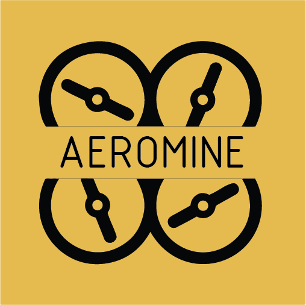
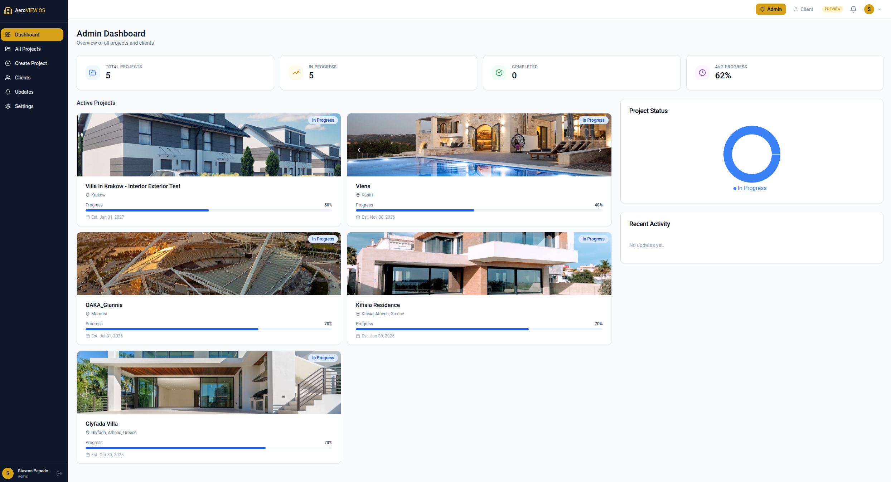
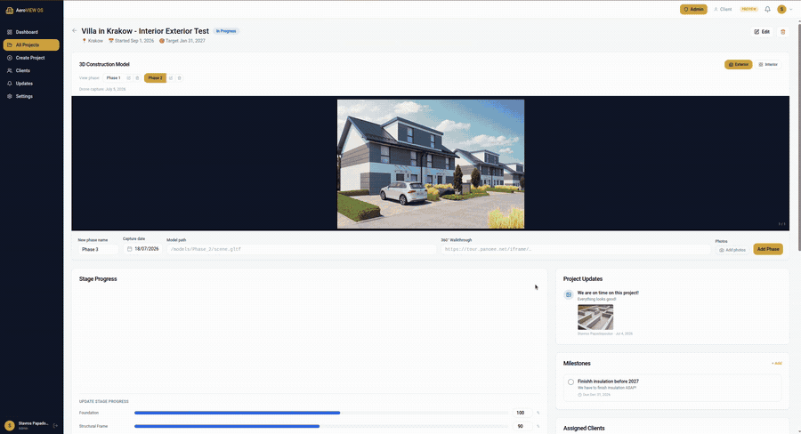
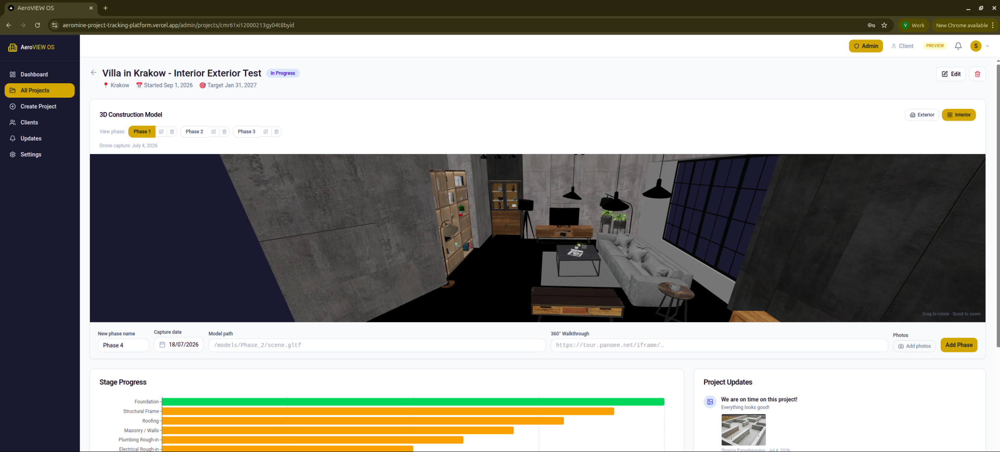
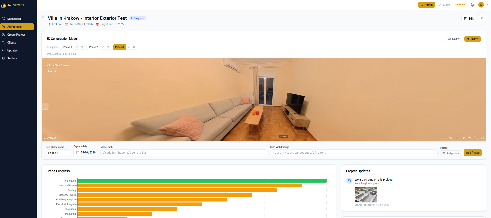
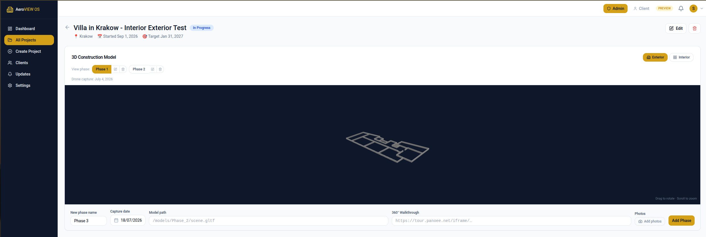
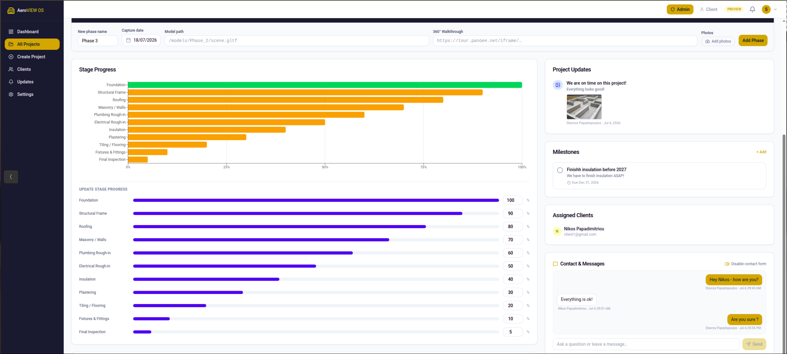
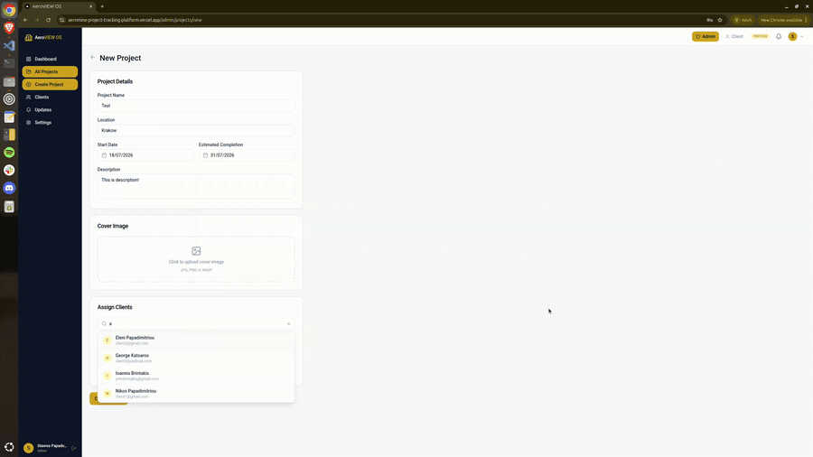

# AeroVIEW OS

### Construction progress tracking, in real time — with live 3D drone models.

AeroVIEW OS gives construction companies a way to show clients exactly how their build is
progressing — from foundation to handover — through live 3D drone models, 360° tours, stage-by-stage
progress, and media updates. No more phone calls, WhatsApp photos, or site visits just to answer
*"where are we?"*

`Bilingual EN / EL` · `Built with Next.js 14` · `Purpose-built for construction`

 

**Live 3D drone models & 360° tours, right in the browser:**

---

## The problem

Construction clients — often homebuyers, and frequently living abroad — spend months in the dark.
Between site visits, the only picture they get of their own building is a phone call, a blurry
WhatsApp photo, or a report that's already out of date.

For the construction company, the cost is the mirror image: hours every week spent assembling
updates, answering *"what stage are we at?"*, and managing anxious clients who can't see the work.

Everyone wants the same thing — a clear, trustworthy, always-current view of the build. Nobody has a
good tool for it.

---

## What AeroVIEW OS is

AeroVIEW OS is a construction project-tracking platform built by **Aeromine**. It pairs the everyday
tracking a project needs — stages, milestones, materials, updates — with the thing generic project
tools can't offer: **live 3D drone models, 360° virtual tours, and digital twins** of the actual site,
captured by Aeromine's drone team and rendered right in the browser.

**Who it's for:**

- **Construction & engineering companies** who want to keep clients informed without drowning in status calls.
- **Their clients** — homebuyers, property investors, and stakeholders — who want to *see* their project, not just read about it.

This is our differentiator. Anyone can track tasks. AeroVIEW OS shows you the building.

---

## What we built

**Live 3D drone models & 360° virtual tours**
Explore GLTF drone-photogrammetry models of the real site directly in the browser — no plugins, no
downloads. Switch each capture between **Photos / 3D / 360°**, and toggle between **Interior** and
**Exterior** views. 360° virtual tours embed seamlessly via Panoee.

**Stage-by-stage progress**
13 preset construction stages (fully bilingual EN/EL), each with an adjustable completion percentage,
so clients always know exactly where the build stands.

**Phases — drone captures over time**
Each phase is a point-in-time drone capture that freezes the state of the build — its models, photos,
360° tour, and every stage's progress on that date. Scroll back through phases to watch the building
rise, capture by capture.

**Milestones**
Track key dates and deliverables. Link a milestone to a stage and it auto-completes when that stage
hits 100%.

**Materials & invoices per stage**
Log materials with quantities and units, and attach invoice PDFs — giving clients full transparency
into what went into each stage.

**Rich media progress updates**
Post updates with photos, PDFs, PowerPoint, Word documents, and video (up to 100 MB per file),
delivered straight to the client's feed.

**Two-way client and company messaging**
Per-project message threads keep every conversation in context, next to the work it's about.

**In-app notifications**
Clients are notified on every key event — stage progress, new updates, new phases, completed
milestones, and logged materials.

**Role-based portal**
A clean split between the **company** (full control over projects, stages, phases, and clients) and
the **client** (a focused, read-only view of their own project). Strict multi-tenant isolation is
enforced on every request — companies and clients only ever see what belongs to them.

**Bilingual & mobile-friendly**
Full English / Greek support with a per-user language preference, in a responsive shell that works on
the phone in your pocket on-site.

---

## How it works

**For the construction company**

1. Create a project and assign it to one or more clients.
2. Update stage progress, log materials and invoices, and post media-rich updates as work advances.
3. Upload each drone capture as a phase — 3D model, photos, and/or a 360° tour.

**For the client**

1. Log in to a personal dashboard of your assigned projects.
2. Explore the live 3D models, 360° tours, and photo galleries — inside and out.
3. Follow stage progress, milestones, and materials, and message the company directly — all in one place.

---

## Under the hood

AeroVIEW OS is a multi-tenant SaaS application built on the Next.js App Router. A few decisions worth
calling out:

- **3D in the browser, no plugins.** Drone photogrammetry models are served as GLTF and rendered with
  React Three Fiber / Three.js, so clients explore the site with nothing but a browser.
- **360° via Panoee.** Virtual tours are embedded from Panoee and canonicalized from a URL, ID, or raw
  iframe snippet, so publishing a tour is effortless.
- **Security by construction.** Every API route enforces tenant isolation server-side — an admin only
  reaches projects they own, a client only reaches projects assigned to them.
- **Direct-to-blob uploads.** Media goes straight from the browser to Vercel Blob, bypassing server
  size limits and keeping large drone assets and videos fast to upload.
- **Bilingual from day one.** Greek and English are first-class, reflecting Greek firms working with
  clients abroad.

| Layer | Technology |
|---|---|
| Framework | Next.js 14 (App Router), TypeScript, React 18 |
| UI | Tailwind CSS, shadcn/ui, Radix UI, Framer Motion |
| 3D / 360° | React Three Fiber, @react-three/drei, Three.js (GLTF) · Panoee |
| Auth | NextAuth v4, bcryptjs (JWT sessions) |
| Data | Prisma 5, PostgreSQL (Neon) |
| Storage | Vercel Blob |
| State / data | SWR, Zustand |
| Hosting | Vercel |

---

## What's next

We're actively building. On the near-term roadmap:

- Email notifications alongside in-app alerts
- Client-invite and password-reset flows
- Complete Greek translations across every screen
- Custom domains
- Richer in-app messaging
- Pagination for large project and update histories

---

## Get in touch

We're onboarding a small group of early users and would love to show you the platform.

- **Email:** [jbrintakis@aeromine.org](mailto:jbrintakis@aeromine.org)
- **Website:** [aeromine.info/contact](https://www.aeromine.info/contact)
- **LinkedIn:** [Aeromine](https://www.linkedin.com/company/aeromine-info)

---

## License

Copyright (c) 2026 Aeromine. All rights reserved.

This software is proprietary and confidential. Unauthorised copying, modification, distribution, or
use of this software, in whole or in part, is strictly prohibited without the express written
permission of Aeromine.
